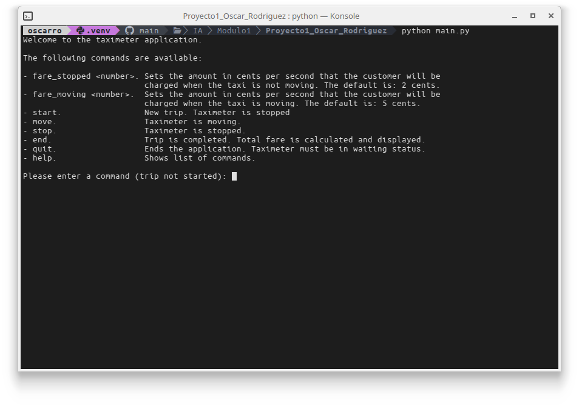

# Taximeter
This is a simple taximeter application. It allows the user to start the taximeter (this
simulates the case when a new customer gets into the taxi), change the status of the 
taximeter from stopped (taxi is not moving) to moving (taxi is moving) and to end the 
taximeter (simulates the customer getting out of the taxi and paying the fare).

### Running the application
First, you have to make sure that the virtual environment is activated before running
the application, to do that, enter the following command from the command line:

`source .venv/bin/activate`

If everything is fine, you should see something similar to this:

Once the virtual environment has been activated, you can run the application with the
following command:

`python main.py`

You should see the following on your terminal window:

From here you can play with the taximeter application. Have fun!